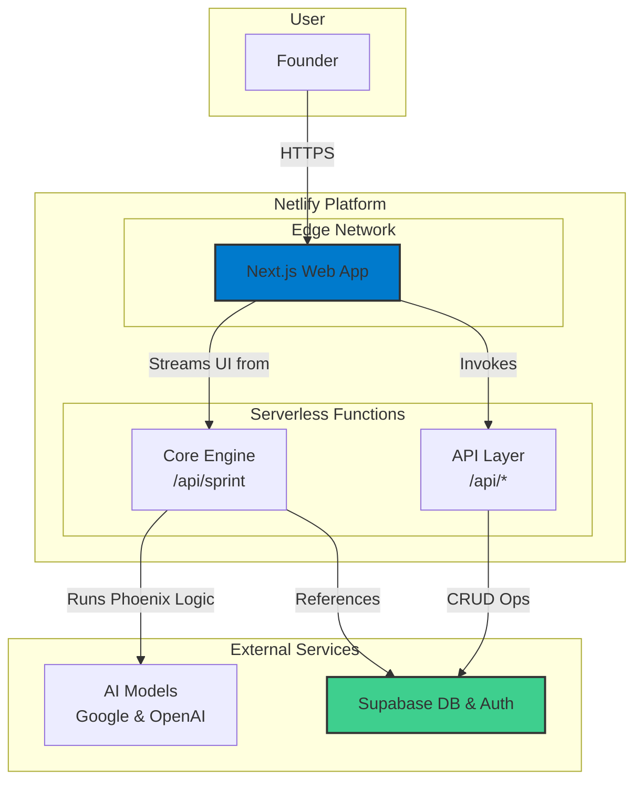

# **The Phoenix Framework Fullstack Architecture Document**

| Date | Version | Description | Author |
| --- | --- | --- | --- |
| 2025-08-24 | 1.0 | Initial architecture draft. | Architect (Winston) |

## **Introduction**

This document outlines the complete fullstack architecture for **The Phoenix Framework**. It serves as the single source of truth for development, ensuring consistency across the entire technology stack. This design adheres to all technical assumptions and the sequential epic plan outlined in the PRD, with a primary focus on a **decoupled core engine** that is cleanly separated from the Next.js presentation layer.

### **Starter Template**

For a greenfield project with this stack, using a starter template can significantly accelerate setup. It is recommended to use an official or community-vetted **Turborepo starter template** that includes Next.js and Tailwind CSS. The architecture defined herein will then be implemented within that structure.

---

## **High Level Architecture**

### **Technical Summary**

The Phoenix Framework will be a **serverless web application** built within a **Turborepo monorepo**. The frontend will be a **Next.js v15.5** application utilizing a modern, conversational UI powered by the Vercel AI SDK and DaisyUI components. The core business logic will reside in a **decoupled TypeScript library** (the "Core Engine"), which will be called by **Netlify Functions**. Persistence and authentication will be handled by **Supabase**. This architecture prioritizes scalability, developer experience, and a clean separation of concerns.

### **Platform and Infrastructure Choice**

- **Platform:** **Netlify**.
- **Key Services:** Netlify Functions for backend logic, Netlify Edge for hosting the Next.js application, and Netlify's build system for continuous deployment.

### **Repository Structure**

- **Structure:** **Monorepo**.
- **Monorepo Tool:** **Turborepo v2.5.6**.

### **High Level Architecture Diagram**



### **Architectural Patterns**

- **Serverless Architecture:** All backend logic is executed in stateless, event-driven functions, eliminating the need for server management.
- **Monorepo:** Manages frontend, backend, and shared code within a single repository for streamlined development and dependency management.
- **Decoupled Logic Engine:** The core business logic of the "Phoenix Framework" is isolated in a UI-agnostic TypeScript package, allowing it to be tested independently and used by any interface (web, CLI, etc.).
- **Component-Based UI:** The frontend will be composed of reusable, self-contained React components, styled with DaisyUI.

---

## **Tech Stack**

This table is the definitive technology selection for the project.

| Category | Technology | Version | Purpose | Rationale |
| --- | --- | --- | --- | --- |
| **Runtime** | Node.js | v24 | JavaScript runtime | Latest stable version for modern features and performance. |
| **Monorepo Tool** | Turborepo | v2.5.6 | Build system for monorepos | High-performance build caching and task orchestration. |
| **Framework** | Next.js | v15.5 | Frontend/Fullstack Framework | Industry-standard React framework for production applications. |
| **AI Integration** | Vercel AI SDK | v5.0.15 | AI library for frontend | Provides core hooks and utilities for streaming conversational UI. |
| **AI UI Components** | Vercel AI Elements | v1.0.5 | React components for AI apps | Accelerates development of AI-specific interfaces. |
| **AI Models** | @ai-sdk/google | v2.0.8 | Google Gemini SDK | Interface for using Google's AI models. |
| **AI Models** | @ai-sdk/openai | v2.0.15 | OpenAI SDK | Interface for using OpenAI's models. |
| **UI Library** | DaisyUI | v5.0.50 | Tailwind CSS Component Library | Provides a rich set of unstyled components, aligning with a minimalist aesthetic. |
| **Styling** | Tailwind CSS | v4.1.12 | Utility-First CSS Framework | Enables rapid and consistent styling. |
| **State Management** | Zustand | v5.0.7 | Minimalist State Management | Simple, unopinionated state management solution that reduces boilerplate. |
| **Animation** | Framer Motion | v12.23.12 | Animation Library for React | Powerful and easy-to-use library for fluid UI animations. |
| **Utilities** | clsx | v2.1.1 | Classname utility | Simple utility for conditionally joining class names. |
| **Utilities** | input-otp | v1.4.2 | One-time password input | Specialized component for handling OTP inputs if needed for auth. |
| **Database & Auth** | Supabase JS | v2.53 | Supabase Client Library | Official SDK for interacting with the Supabase backend. |
| **Payments** | Stripe JS | v7.8 | Stripe Client Library | Frontend library for Stripe payments (for future monetization). |
| **Payments** | Stripe Node | v18.4.0 | Stripe Server-side Library | Backend library for Stripe integration (for future monetization). |
| **Unit/Integration Testing** | Vitest | v3.4.2 | Test Runner | Modern, fast, and Vite-native test framework. |
| **E2E Testing** | Playwright | v1.55 | End-to-End Testing Tool | Robust and reliable for cross-browser end-to-end testing. |

---

## **Data Models**

The initial data models required for Epic 3 will be simple, focusing on users and their saved decision sprints.

### **User**

- **Purpose:** To store user account information from Supabase Auth.
- **Key Attributes:**
    - `id`: `UUID` - Primary key, references `auth.users.id`.
    - `email`: `string` - User's email address.
    - `created_at`: `timestamp` - When the user signed up.
- **TypeScript Interface:**TypeScript
    
    ```tsx
    interface User {
      id: string;
      email: string;
      createdAt: Date;
    }
    ```
    

### **DecisionSprint**

- **Purpose:** To store the output ("Commitment Memo") of a completed Phoenix Framework sprint.
- **Key Attributes:**
    - `id`: `UUID` - Primary key.
    - `user_id`: `UUID` - Foreign key to the `User` table.
    - `problem_brief`: `JSONB` - The validated problem statement.
    - `commitment_memo`: `JSONB` - The final decision, rationale, and risks.
    - `created_at`: `timestamp` - When the sprint was completed.
- **TypeScript Interface:**TypeScript

```tsx
interface DecisionSprint {
  id: string;
  userId: string;
  problemBrief: Record<string, any>;
  commitmentMemo: Record<string, any>;
  createdAt: Date;
}
```

---

## **API Specification**

The primary user interaction is conversational and will be handled by a streaming API endpoint. Standard REST endpoints will be used for data persistence.

- **Streaming Endpoint:** `POST /api/sprint`
    - **Purpose:** Handles the entire interactive Phoenix Framework session.
    - **Request Body:** An object containing the current state of the conversation and user inputs.
    - **Response:** A streaming UI response managed by the Vercel AI SDK.
- **Data Endpoints:**
    - `GET /api/decisions`: Fetches all `DecisionSprint` records for the authenticated user.
    - `POST /api/decisions`: Saves a completed `DecisionSprint` record.

---

## **Components**

The system is composed of four major logical components:

1. **Phoenix Core Engine (TypeScript Package):** A UI-agnostic library containing all business logic for the Phoenix Framework. It takes user input and conversation state, calls AI models, and returns structured output.
2. **Web UI (Next.js Application):** The user-facing presentation layer. It manages the conversational UI, renders components, and handles client-side state.
3. **API Layer (Netlify Functions):** A set of serverless functions that serve as the bridge between the Web UI, the Core Engine, and Supabase.
4. **Database (Supabase):** The persistence layer for user data and decision sprints.

---

## **Unified Project Structure**

The project will be structured as a Turborepo monorepo to maintain a clean separation of concerns while enabling easy code sharing.

```
/
├── apps/
│   └── web/                # Next.js frontend application
│       ├── app/
│       ├── components/     # UI components (using DaisyUI)
│       └── ...
├── packages/
│   ├── core/               # The Phoenix Core Engine (decoupled logic)
│   │   └── src/
│   ├── ui/                 # Shared UI components & theme config
│   └── config/             # Shared configurations (ESLint, TypeScript)
└── package.json            # Root package.json
```

---

## **Development Workflow**

### **Local Setup**

1. Clone the repository.
2. Install dependencies: `npm install`
3. Set up local environment variables in `.env` files.
4. Run the development server: `npm run dev`

### **Required Environment Variables**

```
# In apps/web/.env.local
NEXT_PUBLIC_SUPABASE_URL=...
NEXT_PUBLIC_SUPABASE_ANON_KEY=...

# In a root .env file for the Core Engine
GOOGLE_API_KEY=...
OPENAI_API_KEY=...
SUPABASE_SERVICE_ROLE_KEY=...
```

---

## **Deployment Architecture**

### **Deployment Strategy**

- **Frontend:** The Next.js application in `apps/web` will be deployed to **Netlify's Edge Network**.
- **Backend:** API routes and any functions using the Core Engine will be automatically deployed as **Netlify Functions**.
- **CI/CD:** The process will be managed by Netlify's build system, connected directly to the Git repository. Pushes to the `main` branch will trigger a production deployment.

### **Netlify Configuration (`netlify.toml`)**

A basic `netlify.toml` at the root of the monorepo will control the build process.

Ini, TOML

```
[build]
  command = "npm run build"
  publish = "apps/web/.next"

[build.environment]
  # Environment variables can be set here or in Netlify UI

[[plugins]]
  package = "@netlify/plugin-nextjs"
```

---

## **Coding Standards**

1. **Strict Decoupling:** The `packages/core` engine **must not** contain any React or DOM-specific code. It should be pure TypeScript.
2. **Type Sharing:** All shared data structures (e.g., `DecisionSprint`) should be defined in `packages/core` and imported by the `apps/web` application to ensure type safety.
3. **State Management:** All client-side state in the web app will be managed with **Zustand**. Avoid prop-drilling.
4. **Styling:** All components will be styled using **Tailwind CSS** and **DaisyUI** classes. Avoid custom CSS files where possible.