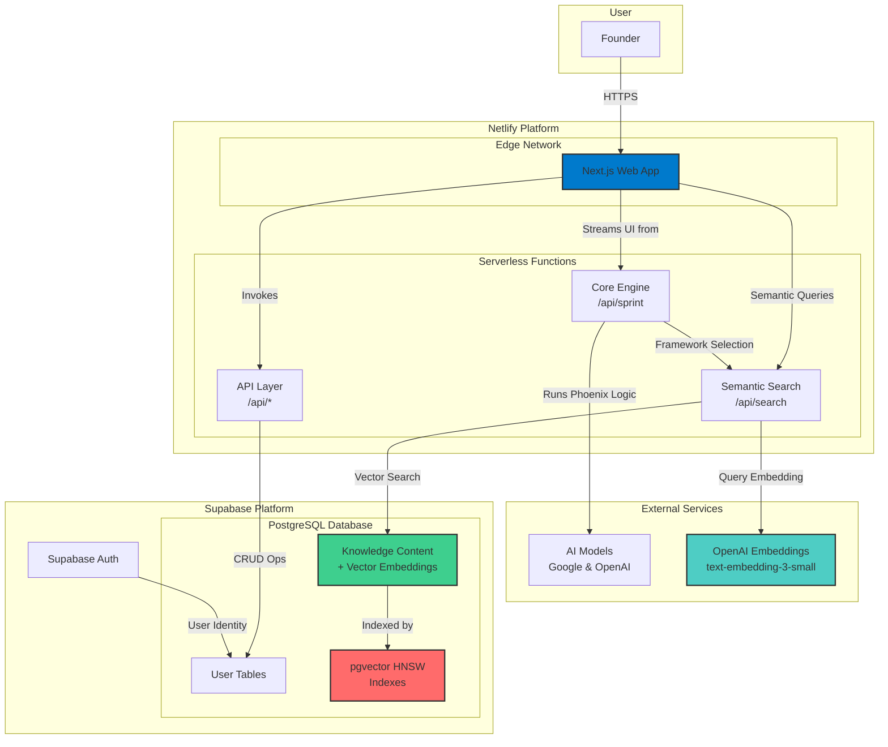
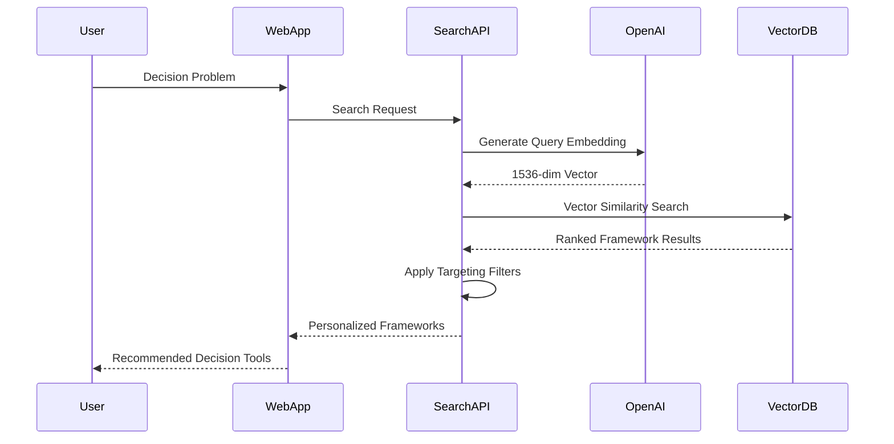

# **High Level Architecture**

## **Technical Summary**

The Phoenix Framework will be a **serverless web application** built within a **Turborepo monorepo**. The frontend will be a **Next.js v15.5** application utilizing a modern, conversational UI powered by the Vercel AI SDK and DaisyUI components. The core business logic will reside in a **decoupled TypeScript library** (the "Core Engine"), which will be called by **Netlify Functions**. Persistence and authentication will be handled by **Supabase**. This architecture prioritizes scalability, developer experience, and a clean separation of concerns.

## **Platform and Infrastructure Choice**

- **Platform:** **Netlify**.
- **Key Services:** Netlify Functions for backend logic, Netlify Edge for hosting the Next.js application, and Netlify's build system for continuous deployment.

## **Repository Structure**

- **Structure:** **Monorepo**.
- **Monorepo Tool:** **Turborepo v2.5.6**.

## **High Level Architecture Diagram**

## **Architectural Patterns**

- **Serverless Architecture:** All backend logic is executed in stateless, event-driven functions, eliminating the need for server management.
- **Monorepo:** Manages frontend, backend, and shared code within a single repository for streamlined development and dependency management.
- **Decoupled Logic Engine:** The core business logic of the "Phoenix Framework" is isolated in a UI-agnostic TypeScript package, allowing it to be tested independently and used by any interface (web, CLI, etc.).
- **Component-Based UI:** The frontend will be composed of reusable, self-contained React components, styled with DaisyUI.
- **Vector Database Architecture:** Utilizes PostgreSQL with pgvector extension for high-performance semantic search across mental models and frameworks.
- **AI-Powered Knowledge Retrieval:** Implements sophisticated semantic search using OpenAI embeddings to match user problems with relevant decision-making frameworks.
- **Multi-Dimensional Content Targeting:** Advanced filtering system based on user persona, startup phase, and problem categories for personalized framework recommendations.

## **Knowledge & Search Architecture**

### **Vector Database Layer**

The Phoenix Framework leverages a sophisticated vector database architecture built on PostgreSQL with the pgvector extension:

- **Vector Storage**: 1536-dimensional embeddings generated by OpenAI's text-embedding-3-small model
- **Indexing Strategy**: HNSW (Hierarchical Navigable Small World) indexes for fast approximate nearest neighbor search
- **Search Performance**: Sub-second query response times with configurable similarity thresholds
- **Scalability**: Designed to handle thousands of knowledge items with room for expansion

### **Semantic Search Pipeline**

### **Content Management System**

The knowledge base:

- **Content Types**: Mental models, cognitive biases, fallacies, strategic frameworks, tactical tools
- **Rich Structure**: Hook, definition, analogies, examples, pitfalls, payoffs, and deep-dive content
- **Categorization**: Hierarchical system with 5 main categories and 18 subcategories
- **Targeting**: Multi-dimensional filtering by persona, startup phase, and problem category
- **Versioning**: Content update pipeline with embedding regeneration

### **AI Integration Points**

1. **Framework Selection**: Semantic matching of user problems to relevant mental models
2. **Content Generation**: Dynamic embedding creation for new knowledge content
3. **Personalization**: Context-aware recommendations based on user profile and situation
4. **Search Optimization**: Continuous improvement of search relevance through usage analytics

---
