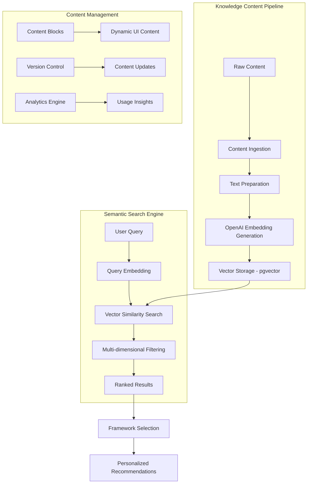

# **Knowledge System Architecture**

## **Overview**

The Phoenix Framework's Knowledge System is a sophisticated, AI-powered knowledge management platform that stores, organizes, and retrieves mental models, cognitive biases, fallacies, strategic frameworks, and tactical tools. It uses vector embeddings for semantic search and a rich content structure to help startup founders access the right decision-making frameworks at the right time.

## **System Architecture**



## **Core Components**

### **1. Knowledge Content Model**

The system stores five types of knowledge content:

- **Mental Models**: Foundational thinking frameworks (e.g., First Principles, Inversion)
- **Cognitive Biases**: Systematic errors in thinking (e.g., Confirmation Bias, Anchoring)
- **Logical Fallacies**: Flawed reasoning patterns (e.g., Ad Hominem, Straw Man)
- **Strategic Frameworks**: High-level decision-making tools (e.g., SWOT, OKRs)
- **Tactical Tools**: Specific implementation methods (e.g., A/B Testing, Customer Interviews)

### **2. Content Structure**

Each piece of content follows a structured approach designed to maximize understanding and application:

#### **Crystallize Phase (Understanding)**
- **Hook**: Engaging opener that connects abstract concepts to familiar experiences
- **Definition**: Clear, jargon-free 1-2 sentence explanation
- **Analogy/Metaphor**: Powerful conceptual bridge for intuitive understanding
- **Key Takeaway**: Tweet-sized summary of the core concept

#### **Apply Phase (Implementation)**
- **Classic Example**: Well-known historical or academic example
- **Modern Example**: Contemporary, relatable scenario
- **Pitfall**: What happens when you ignore this concept
- **Payoff**: Benefits when applied correctly

#### **Deep Dive (Mastery)**
- **Mechanism**: How it works cognitively/psychologically
- **Origin Story**: Historical development and key contributors
- **Pitfalls & Nuances**: Advanced limitations and edge cases

### **3. Vector Embedding System**

**Technology**: OpenAI text-embedding-3-small (1536 dimensions)
**Storage**: PostgreSQL with pgvector extension
**Search Method**: Cosine similarity with configurable thresholds

#### **Content Preparation Pipeline**
1. **Text Concatenation**: Combines title, definition, examples, and key content
2. **Preprocessing**: Cleans and normalizes text for optimal embedding quality
3. **Batch Processing**: Handles rate limiting and retry logic for API calls
4. **Validation**: Ensures embedding dimensions and quality

#### **Search Optimization**
- **Index Type**: HNSW (Hierarchical Navigable Small World) for fast approximate search
- **Similarity Threshold**: Configurable threshold (default: 0.5) to balance precision/recall
- **Batch Size**: Optimized batch processing to manage API costs

### **4. Multi-Dimensional Targeting System**

The system enables precise content targeting through multiple dimensions:

#### **Target Persona Filtering**
- **Founder**: Early-stage decision makers
- **Executive**: C-level operational leaders  
- **Investor**: Capital allocation and evaluation
- **Product Manager**: Feature and roadmap decisions

#### **Startup Phase Contextualization**
- **Ideation**: Concept validation and initial planning
- **Seed**: Early product development and market fit
- **Growth**: Scaling operations and market expansion
- **Scale-up**: Enterprise-level challenges and optimization
- **Crisis**: Turnaround and pivot scenarios

#### **Problem Category Mapping**
Strategic decision areas:
- Pivot, Hiring, Fundraising
- Co-founder Conflict, Product-Market Fit
- Go-to-Market, Team & Culture
- Operations, Competitive Strategy
- Pricing, Risk Management

### **5. Hierarchical Categorization**

#### **Main Categories (5)**
1. **Core Sciences & Mathematics**: Physics, engineering, statistics
2. **Biology & Evolution**: Natural selection, ecosystems, adaptation
3. **Psychology & Human Behavior**: Cognitive patterns, social dynamics
4. **Thinking & Learning Processes**: Problem-solving, decision-making
5. **Human Systems & Strategy**: Economics, business, governance

#### **Subcategories (18)**
Granular classification within each main category for precise organization and filtering.

## **Search & Recommendation Engine**

### **Multi-Pool Search Strategy**

The system implements sophisticated search algorithms that can operate across different knowledge pools:

1. **Broad Semantic Search**: Initial vector similarity across all content
2. **Subcategory Filtering**: Narrow to relevant knowledge domains  
3. **Context Filtering**: Apply persona, phase, and problem category filters
4. **Super Model Prioritization**: Boost foundational concepts when appropriate
5. **Relevance Ranking**: Final scoring based on multiple signals

### **Search Functions**

#### **Primary Search Functions**
```sql
-- Language-based semantic search
match_knowledge_content_by_language(
    query_embedding vector(1536),
    match_threshold float DEFAULT 0.5,
    match_count int DEFAULT 5,
    target_language text DEFAULT 'English'
)

-- Multi-dimensional filtered search
match_knowledge_content_by_subcategory(
    query_embedding vector(1536),
    match_threshold float DEFAULT 0.5,
    match_count int DEFAULT 5,
    target_language text DEFAULT NULL,
    subcategories text[] DEFAULT NULL
)
```

#### **Advanced Features**
- **Similarity Thresholding**: Configurable quality gates
- **Result Limiting**: Prevents overwhelming users with too many options
- **Language Support**: Infrastructure for multilingual expansion
- **Performance Optimization**: Indexed searches with sub-second response times

## **Content Management & Versioning**

### **Dynamic Content Blocks**
Separate content management for UI elements:
- Modal messages and guidance text
- Feature announcements and help content
- A/B testing content variations
- Markdown support with metadata configuration

### **Content Update Pipeline**
1. **Batch Processing**: Efficient updates for large content sets
2. **Embedding Regeneration**: Automatic re-embedding on content changes
3. **Version Control**: Track changes and enable rollbacks
4. **Publishing Workflow**: Staged deployment with approval gates

## **Performance & Scalability**

### **Database Optimization**
- **Vector Indexing**: HNSW indexes for fast similarity search
- **Composite Indexes**: Multi-column indexes for filtered queries
- **Connection Pooling**: Managed database connections
- **Query Optimization**: Optimized search patterns

### **Caching Strategy**
- **Search Result Caching**: Cache frequent query patterns
- **Embedding Caching**: Store commonly used embeddings
- **Content CDN**: Distribute static content globally

### **Cost Management**
- **Embedding Generation**: Batched API calls with retry logic
- **Rate Limiting**: Respect API limits and manage costs
- **Token Optimization**: Efficient text preparation to minimize tokens
- **Usage Analytics**: Monitor and optimize API consumption

## **Analytics & Insights**

### **Content Effectiveness Tracking**
- Framework selection frequency by problem type
- User engagement with different content types
- Success correlation with applied frameworks
- Content gap identification

### **Search Performance Metrics**
- Query-to-selection conversion rates
- Search result relevance scoring
- User refinement patterns
- Semantic drift over time

## **Security & Data Privacy**

### **Access Control**
- **Row Level Security**: User-specific data isolation
- **Authentication Integration**: Supabase Auth integration
- **Role-Based Access**: Different permission levels for different user types

### **Data Protection**
- **Encryption at Rest**: Database encryption
- **API Security**: Secure API endpoints with authentication
- **PII Handling**: Minimal personal data collection
- **GDPR Compliance**: Data deletion and export capabilities

## **Future Expansion Opportunities**

### **Advanced AI Features**
- **Dynamic Content Generation**: AI-generated examples and analogies
- **Personalized Learning Paths**: Adaptive content recommendations
- **Conversational Interface**: Natural language knowledge queries
- **Multi-modal Content**: Integration of images, videos, and interactive elements

### **Knowledge Graph Evolution**
- **Relationship Mapping**: Connections between different frameworks
- **Dependency Tracking**: Prerequisites and advanced concepts
- **Contradiction Detection**: Identifying conflicting advice
- **Synthesis Capabilities**: Combining multiple frameworks intelligently

### **Platform Expansion**
- **API Ecosystem**: Third-party integrations and partnerships
- **Multi-language Support**: Global content localization
- **Domain Specialization**: Industry-specific knowledge bases
- **Community Contributions**: User-generated content and validation

---

This Knowledge System Architecture represents a sophisticated foundation that can evolve from decision support tool to comprehensive startup intelligence platform.