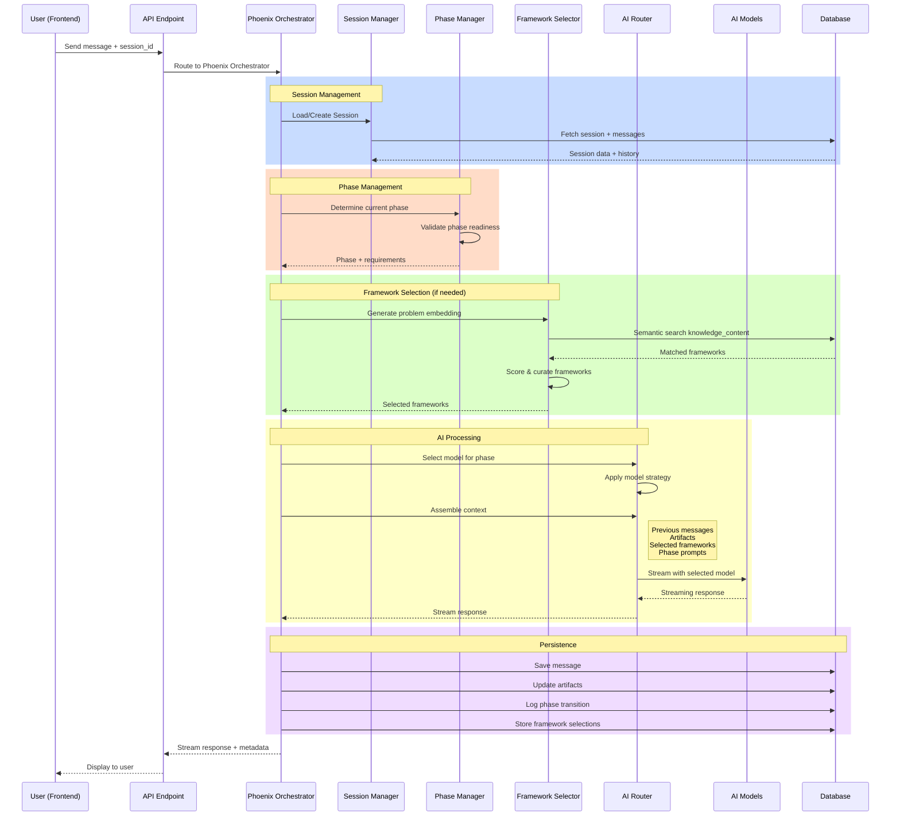

# **Phoenix Core Engine Architecture**

The Phoenix Core Engine is the foundational session management and AI orchestration system that powers all Phoenix Framework decision sprints. It manages conversational sessions, coordinates multiple AI models, handles framework selection, and maintains comprehensive state across multi-phase decision processes with full conversation branching support.

## **System Overview**

The Phoenix Core Engine serves as the central orchestration layer between the user interface, AI models, knowledge base, and data persistence. It transforms the Phoenix Framework methodology into a fully automated, scalable system capable of guiding users through complex decision-making processes with intelligent framework selection and multi-model AI coordination.

### **Key Capabilities**

- **Session Management**: Create, manage, and persist decision sprint sessions with full state tracking
- **Conversation Branching**: Support "jump back" functionality to explore different conversation paths
- **Multi-Model AI Orchestration**: Dynamic routing between GPT-4.1, Gemini Flash, and Gemini Pro based on task requirements
- **Framework Selection**: Semantic search, scoring, and curation of relevant mental models and frameworks
- **Phase Management**: Automated progression through Phoenix Framework phases with validation
- **Performance Tracking**: Comprehensive monitoring of timing, costs, and effectiveness across all operations
- **Real-time Streaming**: Seamless integration with Vercel AI SDK for responsive user experiences

## **Data Flow Architecture**



## **Core Components Architecture**

### **1. Phoenix Orchestrator (Main Controller)**
- **Purpose**: Central coordination engine that manages the entire decision sprint process
- **Responsibilities**:
  - Process incoming messages through appropriate phase handlers
  - Coordinate session management, phase transitions, and framework selection
  - Manage AI model routing and response streaming
  - Track comprehensive performance metrics
  - Handle error recovery and timeout management
- **Location**: `packages/core/src/orchestration/phoenix-orchestrator.ts`
- **Pattern**: Adapted from demo/action-roadmap generator orchestration with Phoenix-specific enhancements

### **2. Session Manager**
- **Purpose**: Manage session lifecycle, message history, and conversation branching
- **Responsibilities**:
  - Create and configure new decision sprint sessions
  - Load and update session state with caching
  - Handle message storage with parent-child relationships for branching
  - Implement "jump back" functionality for conversation exploration
  - Manage versioned artifacts with conflict resolution
- **Location**: `packages/core/src/services/session-manager.ts`
- **Key Features**: Full conversation branching support, state persistence, performance optimization

### **3. Framework Selector**
- **Purpose**: Semantic search, scoring, and curation of relevant knowledge frameworks
- **Responsibilities**:
  - Generate OpenAI embeddings for user problem statements
  - Perform semantic search against knowledge_content using pgvector
  - Score frameworks using multi-dimensional relevance algorithms
  - Curate final framework selection ensuring diversity and complementarity
  - Store detailed scoring breakdowns for transparency
- **Location**: `packages/core/src/services/framework-selector.ts`
- **Algorithm**: Adapted from demo/action-roadmap patterns with Phoenix-specific scoring

### **4. AI Router**
- **Purpose**: Multi-model orchestration with dynamic selection and context assembly
- **Responsibilities**:
  - Select appropriate AI model based on phase and task type
  - Support per-message model override for testing and optimization
  - Assemble prompts with messages, artifacts, and frameworks
  - Integrate with Vercel AI SDK for streaming responses
  - Track performance metrics and manage timeouts
- **Location**: `packages/core/src/services/ai-router.ts`
- **Strategy**: 
  - GPT-4.1 for initial analysis and complex reasoning
  - Gemini 2.5 Flash for quick responses and clarifications
  - Gemini 2.5 Pro for deep thinking and strategy formulation

### **5. Phase Manager**
- **Purpose**: State machine management for Phoenix Framework phases
- **Responsibilities**:
  - Track progression through decision sprint phases
  - Validate phase readiness with comprehensive scoring
  - Manage phase transitions with detailed validation results
  - Support phase rollback for conversation branching scenarios
  - Log transitions with reasoning and triggering context
- **Location**: `packages/core/src/orchestration/phase-manager.ts`
- **Phases**: Problem Intake → Diagnostic Interview → Type Classification → Framework Selection → Framework Application → Commitment Memo Generation

### **6. Phase Handlers**
- **Purpose**: Specialized handlers for each Phoenix Framework phase
- **Responsibilities**:
  - Process messages specific to each phase
  - Validate readiness for phase transitions
  - Generate phase-specific artifacts
  - Apply appropriate frameworks and methodologies
- **Location**: `packages/core/src/phases/` (individual handler files)
- **Interface**: Implements common PhaseHandler interface for consistency

## **Database Schema**

The Phoenix Core Engine requires a comprehensive database schema to support session management, conversation branching, and framework tracking. The complete schema is implemented in the migration file.

### **Core Tables**

#### **Sessions Table**
```sql
CREATE TABLE "public"."sessions" (
    "id" UUID PRIMARY KEY DEFAULT gen_random_uuid(),
    "user_id" UUID NOT NULL REFERENCES "public"."users"("id"),
    "status" session_status DEFAULT 'active' NOT NULL,
    "current_phase" phoenix_phase DEFAULT 'problem_intake' NOT NULL,
    "phase_states" JSONB DEFAULT '{}' NOT NULL,
    "config" JSONB DEFAULT '{}' NOT NULL,
    "metadata" JSONB DEFAULT '{}' NOT NULL,
    "started_at" TIMESTAMP WITH TIME ZONE DEFAULT now() NOT NULL,
    "completed_at" TIMESTAMP WITH TIME ZONE,
    "last_activity_at" TIMESTAMP WITH TIME ZONE DEFAULT now() NOT NULL,
    "created_at" TIMESTAMP WITH TIME ZONE DEFAULT now() NOT NULL,
    "updated_at" TIMESTAMP WITH TIME ZONE DEFAULT now() NOT NULL
);
```

**Purpose**: Tracks Phoenix Framework decision sprint sessions with phase progression and configuration.

**Key Fields**:
- `phase_states`: JSONB object tracking readiness and validation state for each phase
- `config`: Session configuration including model preferences, timeouts, and feature flags
- `last_activity_at`: Automatically updated when messages are added for session management

#### **Messages Table**
```sql
CREATE TABLE "public"."messages" (
    "id" UUID PRIMARY KEY DEFAULT gen_random_uuid(),
    "session_id" UUID NOT NULL REFERENCES "public"."sessions"("id"),
    "parent_message_id" UUID REFERENCES "public"."messages"("id"),
    "role" message_role NOT NULL,
    "content" TEXT NOT NULL,
    "model_used" ai_model_type,
    "phase_number" phoenix_phase NOT NULL,
    "is_active_branch" BOOLEAN DEFAULT true NOT NULL,
    "metadata" JSONB DEFAULT '{}' NOT NULL,
    "performance_metrics" JSONB DEFAULT '{}' NOT NULL,
    "created_at" TIMESTAMP WITH TIME ZONE DEFAULT now() NOT NULL
);
```

**Purpose**: Stores conversation messages with full branching support for exploration and rollback.

**Key Fields**:
- `parent_message_id`: Reference to parent message enabling conversation branching
- `is_active_branch`: Tracks which messages are part of the currently active conversation path
- `performance_metrics`: Timing, token usage, and cost data for each message

#### **Message Embeddings Table**
```sql
CREATE TABLE "public"."message_embeddings" (
    "message_id" UUID PRIMARY KEY REFERENCES "public"."messages"("id"),
    "embedding" vector(1536) NOT NULL,
    "embedding_model" TEXT DEFAULT 'text-embedding-3-small' NOT NULL,
    "generated_at" TIMESTAMP WITH TIME ZONE DEFAULT now() NOT NULL
);
```

**Purpose**: Vector embeddings for messages to enable semantic search and problem understanding.

**Features**:
- Uses pgvector extension for high-performance similarity search
- HNSW indexing for sub-second semantic search operations
- 1536-dimensional vectors matching OpenAI text-embedding-3-small model

#### **Session Artifacts Table**
```sql
CREATE TABLE "public"."session_artifacts" (
    "id" UUID PRIMARY KEY DEFAULT gen_random_uuid(),
    "session_id" UUID NOT NULL REFERENCES "public"."sessions"("id"),
    "artifact_type" artifact_type NOT NULL,
    "content" JSONB NOT NULL,
    "phase_created" phoenix_phase NOT NULL,
    "created_from_message_id" UUID REFERENCES "public"."messages"("id"),
    "version" INTEGER DEFAULT 1 NOT NULL,
    "is_current" BOOLEAN DEFAULT true NOT NULL,
    "created_at" TIMESTAMP WITH TIME ZONE DEFAULT now() NOT NULL,
    "updated_at" TIMESTAMP WITH TIME ZONE DEFAULT now() NOT NULL
);
```

**Purpose**: Stores structured artifacts generated during sessions (problem briefs, commitment memos, etc.).

**Key Features**:
- Versioning system for artifact evolution and history tracking
- Links artifacts to the messages that created them
- Support for multiple artifact types per session

#### **Phase Transitions Table**
```sql
CREATE TABLE "public"."phase_transitions" (
    "id" UUID PRIMARY KEY DEFAULT gen_random_uuid(),
    "session_id" UUID NOT NULL REFERENCES "public"."sessions"("id"),
    "from_phase" phoenix_phase,
    "to_phase" phoenix_phase NOT NULL,
    "validation_results" JSONB DEFAULT '{}' NOT NULL,
    "transition_reason" TEXT,
    "triggered_by_message_id" UUID REFERENCES "public"."messages"("id"),
    "transitioned_at" TIMESTAMP WITH TIME ZONE DEFAULT now() NOT NULL
);
```

**Purpose**: Comprehensive log of phase transitions with validation results and reasoning.

**Features**:
- Detailed validation results for transparency in phase progression
- Links transitions to specific messages that triggered them
- Supports audit trail and debugging of session flow

#### **Framework Selections Table**
```sql
CREATE TABLE "public"."framework_selections" (
    "id" UUID PRIMARY KEY DEFAULT gen_random_uuid(),
    "session_id" UUID NOT NULL REFERENCES "public"."sessions"("id"),
    "knowledge_content_id" UUID NOT NULL REFERENCES "public"."knowledge_content"("id"),
    "relevance_score" FLOAT NOT NULL,
    "score_breakdown" JSONB DEFAULT '{}' NOT NULL,
    "selection_rank" INTEGER NOT NULL,
    "selection_reason" TEXT,
    "was_applied" BOOLEAN DEFAULT false NOT NULL,
    "application_notes" TEXT,
    "selected_at" TIMESTAMP WITH TIME ZONE DEFAULT now() NOT NULL,
    "applied_at" TIMESTAMP WITH TIME ZONE
);
```

**Purpose**: Tracks which knowledge frameworks were selected, scored, and applied during sessions.

**Key Features**:
- Detailed scoring breakdown for transparency in framework selection
- Tracks both selection and application of frameworks
- Ranking system for understanding framework priority

### **Enumeration Types**

```sql
-- Session status tracking
CREATE TYPE "public"."session_status" AS ENUM (
    'active', 'completed', 'abandoned', 'paused'
);

-- Phoenix Framework phases
CREATE TYPE "public"."phoenix_phase" AS ENUM (
    'problem_intake', 'diagnostic_interview', 'type_classification',
    'framework_selection', 'framework_application', 'commitment_memo_generation'
);

-- Artifact types for session artifacts
CREATE TYPE "public"."artifact_type" AS ENUM (
    'problem_brief', 'commitment_memo', 'diagnostic_notes',
    'classification_result', 'framework_application_notes', 'user_insights'
);

-- AI model types for tracking which model was used
CREATE TYPE "public"."ai_model_type" AS ENUM (
    'gpt-4.1', 'gpt-4.1-mini', 'gemini-2.5-flash', 
    'gemini-2.5-pro', 'claude-3.5-sonnet'
);

-- Message roles
CREATE TYPE "public"."message_role" AS ENUM (
    'user', 'assistant', 'system'
);
```

### **Performance Optimization**

The schema includes comprehensive indexing for optimal performance:

```sql
-- Session indexes for fast lookup and filtering
CREATE INDEX "idx_sessions_user_id" ON "public"."sessions" USING btree ("user_id");
CREATE INDEX "idx_sessions_status" ON "public"."sessions" USING btree ("status");
CREATE INDEX "idx_sessions_current_phase" ON "public"."sessions" USING btree ("current_phase");

-- Message indexes for conversation retrieval and branching
CREATE INDEX "idx_messages_session_id" ON "public"."messages" USING btree ("session_id");
CREATE INDEX "idx_messages_active_branch" ON "public"."messages" USING btree ("session_id", "is_active_branch") 
    WHERE "is_active_branch" = true;

-- Vector search optimization
CREATE INDEX "idx_message_embeddings_embedding" ON "public"."message_embeddings" 
    USING hnsw ("embedding" vector_cosine_ops);

-- Framework selection optimization
CREATE INDEX "idx_framework_selections_score" ON "public"."framework_selections" 
    USING btree ("relevance_score" DESC);
```

## **Integration Points**

### **Knowledge Management System Integration**
- **Existing Tables**: Leverages existing `knowledge_content` table with embeddings
- **Search Functions**: Uses existing `match_knowledge_content_by_subcategory()` function
- **Enhancement**: Adds framework selection tracking and application notes

### **User Management Integration**
- **Authentication**: Integrates with Supabase Auth via existing `users` table
- **Subscriptions**: Connects with existing `user_subscriptions` for access control
- **Security**: Implements Row Level Security (RLS) policies for all new tables

### **Frontend Integration**
- **API Endpoint**: Provides clean REST API at `/api/sprint` for future Sprint View
- **Streaming**: Seamless integration with Vercel AI SDK for real-time responses
- **State Management**: Supports Zustand integration for frontend state synchronization

## **AI Model Strategy**

The Phoenix Core Engine implements a sophisticated multi-model strategy optimized for different types of cognitive tasks:

### **Model Selection Logic**
- **GPT-4.1**: Used for initial problem analysis, complex reasoning, and strategic thinking
- **Gemini 2.5 Flash**: Handles quick responses, clarifications, and routine interactions
- **Gemini 2.5 Pro**: Applied for deep thinking, framework application, and commitment memo generation

### **Context Assembly Strategy**
- **Message History**: Includes relevant conversation history with proper truncation
- **Phase Context**: Injects phase-specific prompts and requirements
- **Framework Context**: Includes selected frameworks with full content structure
- **User Profile**: Incorporates user preferences and historical patterns
- **Artifact Context**: References current session artifacts for continuity

### **Performance Monitoring**
- **Token Tracking**: Monitors token usage across all models for cost optimization
- **Response Times**: Tracks latency for each model and operation type
- **Success Rates**: Monitors completion rates and error frequencies
- **Cost Analysis**: Provides detailed cost breakdowns by model and operation

## **Security & Privacy**

### **Data Security**
- **Row Level Security**: All tables implement RLS policies ensuring users can only access their own data
- **Encryption**: All data encrypted in transit and at rest via Supabase infrastructure
- **API Security**: Endpoints protected by Supabase Auth with proper token validation

### **Privacy Considerations**
- **Data Isolation**: Complete isolation between user sessions and data
- **Conversation Privacy**: No cross-user access to messages or artifacts
- **Framework Selection Privacy**: User's framework preferences and applications remain private

### **Audit & Compliance**
- **Activity Logging**: Comprehensive logging of all user actions and system operations
- **Data Retention**: Configurable retention policies for conversations and artifacts
- **Export Capabilities**: Users can export their complete decision sprint history

## **Performance Characteristics**

### **Target Performance Metrics**
- **Session Load Time**: < 200ms for existing sessions
- **Message Processing**: < 500ms end-to-end (excluding AI model response time)
- **Framework Search**: < 100ms for semantic search with ranking
- **Phase Transition**: < 50ms for validation and state updates
- **Database Operations**: < 50ms for CRUD operations with proper indexing

### **Scalability Design**
- **Horizontal Scaling**: Stateless service design enables horizontal scaling
- **Database Performance**: Optimized indexes and queries for high-concurrency usage
- **Caching Strategy**: Session state caching reduces database load
- **Rate Limiting**: Built-in rate limiting for AI model calls and expensive operations

## **Error Handling & Recovery**

### **Error Categories**
- **AI Model Errors**: Timeout, rate limiting, model unavailability
- **Database Errors**: Connection issues, constraint violations, deadlocks
- **Validation Errors**: Invalid phase transitions, malformed artifacts
- **User Errors**: Invalid input, unauthorized access attempts

### **Recovery Strategies**
- **Graceful Degradation**: System continues operating with reduced functionality when services are unavailable
- **Retry Logic**: Exponential backoff for transient failures with configurable limits
- **Fallback Models**: Automatic fallback to alternative AI models when primary models are unavailable
- **State Recovery**: Session state reconstruction from database in case of service restarts

## **Future Extensibility**

### **Plugin Architecture**
- **Phase Handlers**: New phase types can be added by implementing PhaseHandler interface
- **AI Models**: New models can be integrated by extending AIRouter service
- **Artifact Types**: New artifact types can be added via enum extension and content type unions

### **Integration Capabilities**
- **External APIs**: Framework for integrating external decision-making tools and data sources
- **Webhook Support**: Event-driven notifications for session milestones and completions
- **Analytics Integration**: Built-in support for analytics and usage tracking systems

## **Migration & Deployment**

### **Database Migration**
The complete schema is implemented in:
```
supabase/migrations/20250825_phoenix_core_session_management.sql
```

### **Deployment Considerations**
- **Zero-Downtime Deployment**: Schema changes designed for backward compatibility
- **Environment Configuration**: Environment-specific settings for AI model endpoints and keys
- **Monitoring Setup**: Comprehensive logging and metrics collection for production monitoring

This architecture provides a robust, scalable foundation for the Phoenix Framework's conversational AI system while maintaining flexibility for future enhancements and integrations.